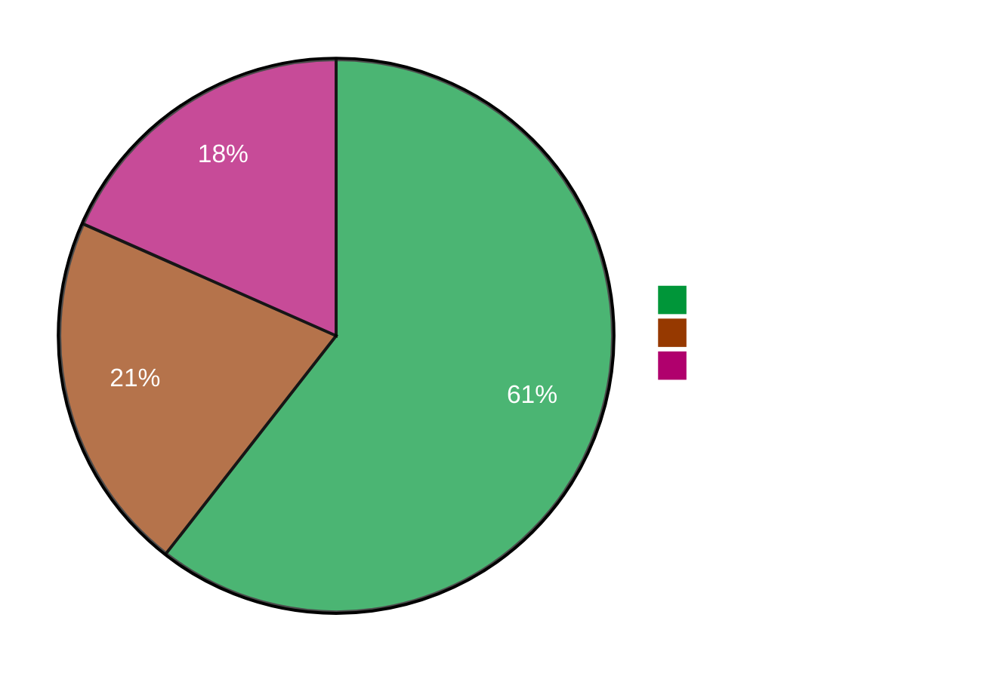

# :material-zip-box: Enable Brotli Compression on NGINX

<p class="subtitle" style="font-size: 1.3rem; opacity: 0.9; margin-top: -0.5rem;">
Compress your content 15-25% better than gzip with Google's Brotli algorithm.
</p>

---

<div class="grid cards" markdown>

-   :material-chart-line:{ .lg .middle } **15-25% Smaller**

    ---

    Brotli achieves better compression ratios than gzip for text content

-   :material-earth:{ .lg .middle } **Universal Support**

    ---

    All modern browsers support Brotli (Chrome, Firefox, Safari, Edge)

-   :material-speedometer:{ .lg .middle } **Faster Page Loads**

    ---

    Smaller files = faster downloads, especially on mobile networks

-   :material-currency-usd:{ .lg .middle } **Lower Bandwidth Costs**

    ---

    Reduce data transfer costs with better compression

</div>

---

## :material-check-circle: Browser Support

Brotli is supported by **95%+ of browsers** worldwide:

| Browser | Brotli Support |
|---------|----------------|
| Chrome | ✅ Since v50 (2016) |
| Firefox | ✅ Since v44 (2016) |
| Safari | ✅ Since v11 (2017) |
| Edge | ✅ Since v15 (2017) |
| Opera | ✅ Since v38 (2016) |

NGINX automatically falls back to gzip for older browsers.

---

## :material-clock-fast: Quick Setup

### Step 1: Install the Brotli Module

```bash
# Install GetPageSpeed repository
dnf -y install https://extras.getpagespeed.com/release-latest.rpm

# Install Brotli module
dnf -y install nginx-module-brotli
```

Enable in `/etc/nginx/nginx.conf`:

```nginx
load_module modules/ngx_http_brotli_filter_module.so;
load_module modules/ngx_http_brotli_static_module.so;
```

---

### Step 2: Configure Brotli Compression

Create `/etc/nginx/conf.d/brotli.conf`:

```nginx
# Enable Brotli compression
brotli on;
brotli_comp_level 6;
brotli_static on;

brotli_types
    text/plain
    text/css
    text/javascript
    text/xml
    application/javascript
    application/json
    application/xml
    application/xml+rss
    application/xhtml+xml
    application/atom+xml
    application/rss+xml
    application/x-javascript
    application/x-font-ttf
    application/x-font-opentype
    application/vnd.ms-fontobject
    font/ttf
    font/otf
    font/opentype
    font/woff
    font/woff2
    image/svg+xml
    image/x-icon;
```

Reload NGINX:

```bash
nginx -t && systemctl reload nginx
```

---

### Step 3: Verify It's Working

```bash
# Request with Brotli support
curl -sI -H 'Accept-Encoding: br' https://example.com | grep -i encoding
# Content-Encoding: br

# Compare sizes
curl -so /dev/null -w '%{size_download}' -H 'Accept-Encoding: gzip' https://example.com
# 45678
curl -so /dev/null -w '%{size_download}' -H 'Accept-Encoding: br' https://example.com
# 38912  (smaller!)
```

---

## :material-tune: Compression Levels

| Level | Speed | Compression | Use Case |
|-------|-------|-------------|----------|
| 1-3 | Fast | Lower | High-traffic, CPU-constrained |
| **4-6** | **Balanced** | **Good** | **Most websites (recommended)** |
| 7-9 | Slower | Better | Pre-compressed static assets |
| 10-11 | Very slow | Best | Build-time compression only |

!!! tip "Recommendation"
    Use level **4-6** for dynamic content and level **11** for pre-compressed static assets.

---

## :material-file-document-multiple: Pre-Compress Static Assets

For maximum performance, pre-compress files at build time:

```bash
# Install Brotli CLI tool
dnf -y install brotli

# Compress your static files
find /var/www/html -type f \( -name "*.css" -o -name "*.js" -o -name "*.html" -o -name "*.svg" \) \
    -exec brotli -kf --best {} \;
```

This creates `.br` files alongside originals. NGINX serves these automatically with `brotli_static on`.

---

## :material-chart-timeline-variant: Size Comparison

Real-world example (jQuery 3.6.0 minified):



| Format | Size | Savings |
|--------|------|---------|
| Original | 89 KB | — |
| Gzip | 31 KB | 65% |
| Brotli | 27 KB | **70%** |

---

## :material-cog: Advanced Configuration

### Keep Gzip as Fallback

```nginx
# Brotli (priority)
brotli on;
brotli_comp_level 6;

# Gzip (fallback)
gzip on;
gzip_comp_level 5;
gzip_types text/plain text/css application/javascript application/json;
```

### Different Levels for Dynamic vs Static

```nginx
# Dynamic content - faster compression
brotli on;
brotli_comp_level 4;

# Pre-compressed static files - best compression
brotli_static on;
```

### Minimum Size Threshold

```nginx
# Don't compress tiny files (not worth it)
brotli_min_length 256;
```

---

## :material-wrench: Troubleshooting

??? question "Brotli not working"

    1. Check module is loaded:
       ```bash
       nginx -V 2>&1 | grep brotli
       ```
    
    2. Verify request includes `Accept-Encoding: br`
    
    3. Check response `Content-Type` is in `brotli_types`

??? question "CPU usage too high"

    Lower compression level:
    ```nginx
    brotli_comp_level 4;  # or even 2-3
    ```

??? question "Files not being compressed"

    - Check file size > `brotli_min_length`
    - Verify `Content-Type` matches `brotli_types`
    - Check connection isn't already compressed (CDN)

---

## :material-link-variant: Related

<div class="grid cards" markdown>

-   :material-package-variant:{ .lg .middle } **Brotli Module**

    ---

    Complete directive reference

    [:octicons-arrow-right-24: Documentation](../modules/brotli.md)

-   :material-arrow-collapse:{ .lg .middle } **Unbrotli Module**

    ---

    Decompress Brotli from backends

    [:octicons-arrow-right-24: Documentation](../modules/unbrotli.md)

-   :material-speedometer:{ .lg .middle } **PageSpeed Module**

    ---

    Additional optimization layer

    [:octicons-arrow-right-24: Documentation](../modules/pagespeed.md)

</div>

