# :material-lightning-bolt: WordPress Cache Purging on CloudLinux EA4

<p class="subtitle" style="font-size: 1.3rem; opacity: 0.9; margin-top: -0.5rem;">
Instant, automatic cache invalidation for WordPress—without clearing your entire cache.
</p>

!!! success "🎉 Free Access - Limited Time!"
    All CloudLinux EA4 modules are currently **free** — no subscription required!
    [Learn more](../cloudlinux-ea4.md)

---

<div class="grid cards" markdown>

-   :material-rocket-launch:{ .lg .middle } **Automatic Invalidation**

    ---

    Cache is purged automatically when you edit posts, pages, or comments—no manual intervention needed

-   :material-target:{ .lg .middle } **Surgical Precision**

    ---

    Only the changed page is purged—your entire site stays cached and blazing fast

-   :material-shield-check:{ .lg .middle } **Multi-Tenant Safe**

    ---

    Each cPanel user's cache is isolated—users cannot purge each other's content

-   :material-puzzle:{ .lg .middle } **Zero Coding Required**

    ---

    Works out of the box with the Proxy Cache Purge WordPress plugin

</div>

---

## :material-clock-fast: 5-Minute Setup

Follow these steps to enable intelligent cache purging on your CloudLinux server.

---

### Step 1: Install the Cache Purge Module

```bash
# Install GetPageSpeed repository (auto-enables cl-ea4 repo on CloudLinux)
dnf -y install https://extras.getpagespeed.com/release-latest.rpm

# Install the cache purge module
dnf -y install ea-nginx-cache-purge
```

---

### Step 2: Configure NGINX

You can enable cache purging globally for all users or per-user.

=== "Global (Recommended)"

    Create `/etc/nginx/conf.d/server-includes/cache-purge.conf`:

    ```nginx
    # Enable PURGE method for cache purging (all users)
    proxy_cache_purge PURGE from 127.0.0.1;
    ```

    This file is automatically included in all cPanel user server blocks.

=== "Per-User"

    For user `username`, create `/etc/nginx/conf.d/users/username/cache-purge.conf`:

    ```nginx
    # Enable PURGE method for cache purging
    proxy_cache_purge PURGE from 127.0.0.1;
    ```

After creating the config, reload NGINX:

```bash
nginx -t && systemctl reload nginx
```

---

### Step 3: Install Proxy Cache Purge Plugin

=== "WordPress Admin"

    1. Go to **Plugins → Add New**
    2. Search for **"Proxy Cache Purge"** (slug: `varnish-http-purge`)
    3. Click **Install Now**, then **Activate**

=== "WP-CLI"

    ```bash
    wp plugin install varnish-http-purge --activate
    ```

---

### Step 4: Configure Proxy Cache Purge

In WordPress admin:

1. Go to **Settings → Proxy Cache Purge**
2. Set **"Set Custom IP"** to: `127.0.0.1`
3. Click **Save Settings**

!!! warning "Critical Setting"
    The plugin must send PURGE requests to `127.0.0.1` (localhost), not your public IP or domain.

---

### Step 5: Add Wildcard Purge Fix

Due to NGINX's `Vary: Accept-Encoding` header, the cache stores separate variants for different 
encodings. 

To ensure all variants are purged, create a mu-plugin `wp-content/mu-plugins/nginx-cache-purge-fix.php` or simply add to your `functions.php`:

```php
<?php
/**
 * Plugin Name: NGINX Cache Purge Fix
 * Description: Appends wildcard to purge URLs for Vary header compatibility
 */
add_filter("vhp_purgeme_path", function($purgeme, $schema, $host, $path, $pregex, $p) {
    // Add wildcard to purge all cache variants (gzip, br, etc.)
    if (empty($pregex)) {
        $purgeme .= "*";
    }
    return $purgeme;
}, 10, 6);
```

This ensures that when a page is purged, all cached variants (gzip, brotli, uncompressed) are cleared.

---

## :material-test-tube: Test the Setup

```bash
# 1. Cache a page (first request = MISS, second = HIT)
curl -sI http://127.0.0.1/sample-page/ -H 'Host: yourdomain.com' -H 'Accept-Encoding: gzip' | grep X-Cache
# X-Cache-Status: MISS
curl -sI http://127.0.0.1/sample-page/ -H 'Host: yourdomain.com' -H 'Accept-Encoding: gzip' | grep X-Cache
# X-Cache-Status: HIT

# 2. Purge using PURGE method with wildcard
curl -sX PURGE 'http://127.0.0.1/sample-page/*' -H 'Host: yourdomain.com'
# <h1>Successful purge</h1>

# 3. Verify cache cleared
curl -sI http://127.0.0.1/sample-page/ -H 'Host: yourdomain.com' -H 'Accept-Encoding: gzip' | grep X-Cache
# X-Cache-Status: MISS
```

Then test via WordPress:

1. Edit any published post
2. Make a change and click **Update**
3. The plugin automatically purges the cache
4. Visit the page—it should show fresh content

---

## :material-chart-timeline-variant: How It Works

```mermaid
flowchart TD
    subgraph WordPress["<b>WordPress</b>"]
        A[📝 Post Updated] --> B["🔌 Proxy Cache Purge Plugin"]
        B --> C["PURGE http://127.0.0.1/post-slug/*<br/>Host: yourdomain.com"]
    end
    
    C --> D

    subgraph NGINX["<b>NGINX (ea-nginx)</b>"]
        D["🔒 proxy_cache_purge PURGE from 127.0.0.1"] --> E["🗑️ ngx_cache_purge module"]
        E --> F["✓ Wildcard matches all variants<br/>(gzip, brotli, plain)"]
        F --> G["✓ Deletes from disk cache"]
        G --> H["✅ Returns 'Successful purge'"]
    end

    style WordPress fill:#4a90d9,stroke:#2d5986,color:#fff
    style NGINX fill:#009639,stroke:#006325,color:#fff
    style A fill:#5ba0e0
    style B fill:#5ba0e0
    style C fill:#5ba0e0
    style D fill:#00a844
    style E fill:#00a844
    style F fill:#00a844
    style G fill:#00a844
    style H fill:#00a844
```



<div class="grid" markdown>

<div markdown>

### :material-arrow-right-bold: What Happens

1. You update a post in WordPress
2. Plugin sends `PURGE` request to localhost
3. NGINX module removes **only that URL** from cache
4. Next visitor gets fresh content, rest of cache untouched

</div>

<div markdown>

### :material-lightning-bolt: Why It's Fast

- **No full cache flush** — other pages stay cached
- **Local requests only** — no network latency  
- **Wildcard support** — clears all encoding variants at once

</div>

</div>

---

## :material-speedometer: Advanced: Reduce Cache Variants

!!! tip "Optional Optimization"
    Recommended for high-traffic sites to maximize cache hit rates.

The `Vary: Accept-Encoding` header causes NGINX to create separate cache entries for different 
`Accept-Encoding` combinations. Browsers send these in various orders, creating cache bloat:

| Original Accept-Encoding | Problem |
|--------------------------|---------|
| `gzip, br, deflate` | Separate cache entry |
| `br, gzip` | Another separate entry |
| `gzip, deflate` | Yet another entry |

### The Solution: Normalize Headers

The [`compression-normalize`](../modules/compression-normalize.md) module normalizes headers to consistent values:

```bash
dnf -y install ea-nginx-compression-normalize
```

Create `/etc/nginx/conf.d/compression-normalize.conf`:

```nginx
# Normalize Accept-Encoding to reduce cache variants
# Priority order: prefer brotli, then gzip
compression_normalize_accept_encoding br,gzip br gzip;
```

**Result:** Hundreds of possible variants → just **3** (`br,gzip`, `br`, `gzip`).

---

## :material-security: Security

<div class="grid" markdown>

<div markdown>

### :material-lock: Localhost-Only Access

```nginx
proxy_cache_purge PURGE from 127.0.0.1;
```

External `PURGE` requests are processed as normal requests, not purges.

</div>

<div markdown>

### :material-account-multiple: User Isolation

Each cPanel user has their own cache zone. User `alice` cannot purge user `bob`'s cache—even with the same URL paths.

</div>

</div>

---

## :material-wrench: Troubleshooting

??? question "Cache Not Being Purged"

    1. **Verify the plugin setting:**
       - Go to **Settings → Proxy Cache Purge**
       - Ensure **Custom IP** is set to `127.0.0.1`

    2. **Check the mu-plugin exists:**
       ```bash
       ls -la wp-content/mu-plugins/nginx-cache-purge-fix.php
       ```

    3. **Check NGINX config is loaded:**
       ```bash
       nginx -T | grep cache_purge
       ```

??? question "412 Precondition Failed"

    This means the URL wasn't in cache. Not an error—just nothing to purge.

??? question "Module Not Loading"

    ```bash
    # Check if installed
    rpm -q ea-nginx-cache-purge

    # Check module file
    ls -la /etc/nginx/modules/ngx_http_cache_purge_module.so
    ```

---

## :material-link-variant: Related

<div class="grid cards" markdown>

-   :material-cloud:{ .lg .middle } **CloudLinux EA4 Repository**

    ---

    Full setup guide for cPanel's ea-nginx modules

    [:octicons-arrow-right-24: Learn more](../cloudlinux-ea4.md)

-   :material-package-variant:{ .lg .middle } **cache-purge Module**

    ---

    Complete directive reference and advanced usage

    [:octicons-arrow-right-24: Documentation](../modules/cache-purge.md)

-   :fontawesome-brands-wordpress:{ .lg .middle } **Proxy Cache Purge Plugin**

    ---

    Official WordPress plugin page

    [:octicons-arrow-right-24: WordPress.org](https://wordpress.org/plugins/varnish-http-purge/)

</div>
