# :material-lightning-bolt: FastCGI Cache Purging for PHP-FPM

<p class="subtitle" style="font-size: 1.3rem; opacity: 0.9; margin-top: -0.5rem;">
Ultra-fast caching for WordPress with automatic, surgical cache invalidation.
</p>

---

<div class="grid cards" markdown>

-   :material-flash:{ .lg .middle } **No Proxy Required**

    ---

    FastCGI cache talks directly to PHP-FPM—no reverse proxy overhead

-   :material-speedometer:{ .lg .middle } **Microsecond Response**

    ---

    Cached pages served directly from memory or SSD by NGINX

-   :material-target:{ .lg .middle } **Selective Purging**

    ---

    Only changed pages are purged, rest of cache stays hot

-   :material-shield-lock:{ .lg .middle } **Built-in Security**

    ---

    Bypasses cache for logged-in users, admins, and WooCommerce carts

</div>

---

## :material-arrow-right-bold: When to Use FastCGI vs Proxy Cache

| Feature | FastCGI Cache | Proxy Cache |
|---------|--------------|-------------|
| Backend | PHP-FPM (direct) | Any HTTP backend |
| Latency | Lower (no proxy hop) | Slightly higher |
| Use case | WordPress, PHP apps | Node.js, Python, etc. |
| Config complexity | Simpler | More flexible |

**Use FastCGI cache** if you're running WordPress or PHP directly on NGINX without a reverse proxy layer.

---

## :material-clock-fast: Quick Setup

### Step 1: Install Required Modules

```bash
# Install GetPageSpeed repository
dnf -y install https://extras.getpagespeed.com/release-latest.rpm

# Install cache purge module
dnf -y install nginx-module-cache-purge
```

Enable in `/etc/nginx/nginx.conf`:

```nginx
load_module modules/ngx_http_cache_purge_module.so;
```

---

### Step 2: Configure FastCGI Cache

Add to your `http` block in `/etc/nginx/nginx.conf`:

```nginx
# FastCGI cache zone definition
fastcgi_cache_path /var/cache/nginx/fastcgi 
                   levels=1:2 
                   keys_zone=WORDPRESS:100m 
                   max_size=10g 
                   inactive=60m 
                   use_temp_path=off;

# Cache key (what makes each cached page unique)
fastcgi_cache_key "$scheme$request_method$host$request_uri";
```

---

### Step 3: Configure Server Block

Create or update your WordPress server block:

```nginx
server {
    listen 80;
    server_name example.com www.example.com;
    root /var/www/example.com;
    index index.php;

    # Cache settings
    set $skip_cache 0;

    # Don't cache POST requests
    if ($request_method = POST) {
        set $skip_cache 1;
    }

    # Don't cache URLs with query strings
    if ($query_string != "") {
        set $skip_cache 1;
    }

    # Don't cache WordPress admin, login, or specific paths
    if ($request_uri ~* "/wp-admin/|/wp-login.php|/xmlrpc.php|/wp-cron.php") {
        set $skip_cache 1;
    }

    # Don't cache for logged-in users or recent commenters
    if ($http_cookie ~* "comment_author|wordpress_[a-f0-9]+|wp-postpass|wordpress_logged_in") {
        set $skip_cache 1;
    }

    # Don't cache WooCommerce pages
    if ($request_uri ~* "/cart/|/checkout/|/my-account/") {
        set $skip_cache 1;
    }
    if ($http_cookie ~* "woocommerce_cart_hash|woocommerce_items_in_cart") {
        set $skip_cache 1;
    }

    # Cache status header
    add_header X-Cache-Status $upstream_cache_status;

    # Enable PURGE method
    fastcgi_cache_purge PURGE from 127.0.0.1;

    location / {
        try_files $uri $uri/ /index.php?$args;
    }

    location ~ \.php$ {
        try_files $uri =404;
        
        fastcgi_pass unix:/run/php-fpm/www.sock;
        fastcgi_index index.php;
        fastcgi_param SCRIPT_FILENAME $document_root$fastcgi_script_name;
        include fastcgi_params;

        # FastCGI caching
        fastcgi_cache WORDPRESS;
        fastcgi_cache_valid 200 60m;
        fastcgi_cache_valid 404 1m;
        fastcgi_cache_bypass $skip_cache;
        fastcgi_no_cache $skip_cache;
        
        # Important for dynamic content
        fastcgi_cache_use_stale error timeout invalid_header http_500 http_503;
        fastcgi_cache_lock on;
    }

    # Static files - no caching config needed
    location ~* \.(js|css|png|jpg|jpeg|gif|ico|svg|woff|woff2)$ {
        expires 30d;
        add_header Cache-Control "public, immutable";
    }
}
```

Create cache directory and reload:

```bash
mkdir -p /var/cache/nginx/fastcgi
chown nginx:nginx /var/cache/nginx/fastcgi
nginx -t && systemctl reload nginx
```

---

### Step 4: Install WordPress Plugin

=== "WordPress Admin"

    1. Go to **Plugins → Add New**
    2. Search for **"Proxy Cache Purge"**
    3. Install and activate

=== "WP-CLI"

    ```bash
    wp plugin install varnish-http-purge --activate
    ```

Configure the plugin:

1. Go to **Settings → Proxy Cache Purge**
2. Set **Custom IP** to `127.0.0.1`
3. Save

---

### Step 5: Add Wildcard Purge Support

Create `wp-content/mu-plugins/nginx-cache-purge-fix.php`:

```php
<?php
/**
 * Plugin Name: NGINX FastCGI Cache Purge Fix
 * Description: Appends wildcard to purge all cache variants
 */
add_filter("vhp_purgeme_path", function($purgeme, $schema, $host, $path, $pregex, $p) {
    if (empty($pregex)) {
        $purgeme .= "*";
    }
    return $purgeme;
}, 10, 6);
```

---

## :material-test-tube: Testing

```bash
# First request - should be MISS
curl -sI http://127.0.0.1/ -H 'Host: example.com' | grep X-Cache
# X-Cache-Status: MISS

# Second request - should be HIT
curl -sI http://127.0.0.1/ -H 'Host: example.com' | grep X-Cache
# X-Cache-Status: HIT

# Purge the cache
curl -sX PURGE 'http://127.0.0.1/*' -H 'Host: example.com'

# Verify purged
curl -sI http://127.0.0.1/ -H 'Host: example.com' | grep X-Cache
# X-Cache-Status: MISS
```

---

## :material-chart-timeline-variant: How It Works

```mermaid
flowchart LR
    A["👤 Visitor"] -->|"GET /post/"| B["NGINX"]
    
    B -->|"Cache HIT"| C["⚡ Instant Response"]
    B -->|"Cache MISS"| D["PHP-FPM"]
    D --> E["WordPress"]
    E --> D
    D -->|"Store in cache"| B
    B --> C

    style A fill:#667eea
    style B fill:#009639,color:#fff
    style C fill:#48bb78,color:#fff
    style D fill:#4a90d9,color:#fff
    style E fill:#4a90d9,color:#fff
```



---

## :material-speedometer: Performance Comparison

| Metric | No Cache | FastCGI Cache |
|--------|----------|---------------|
| Response Time | 200-500ms | 5-20ms |
| Requests/sec | 50-100 | 5,000+ |
| CPU Usage | High | Minimal |
| Memory | High (PHP) | Low (NGINX) |

!!! tip "Real-world Impact"
    FastCGI cache typically improves WordPress response times by **10-50x** and can handle traffic spikes without breaking a sweat.

---

## :material-cog: Advanced Configuration

### Cache Different Durations by Content Type

```nginx
# Cache pages for 60 minutes
fastcgi_cache_valid 200 60m;

# Cache redirects for 10 minutes
fastcgi_cache_valid 301 302 10m;

# Don't cache errors for long
fastcgi_cache_valid 404 1m;
fastcgi_cache_valid 500 502 503 504 0;
```

### Serve Stale Content During Errors

```nginx
fastcgi_cache_use_stale error timeout invalid_header 
                        updating http_500 http_502 http_503 http_504;
```

### Cache Lock to Prevent Stampedes

```nginx
fastcgi_cache_lock on;
fastcgi_cache_lock_timeout 5s;
```

When multiple requests hit an uncached page simultaneously, only one request goes to PHP-FPM. Others wait for the cache to populate.

---

## :material-wrench: Troubleshooting

??? question "Pages not being cached"

    Check `$skip_cache` variable. Common issues:
    
    - Query strings on all URLs (some plugins add `?ver=` to pages)
    - Cookies being set on all pages
    - Check: `curl -sI your-url | grep Set-Cookie`

??? question "Logged-in pages being cached"

    Verify the cookie check includes your auth cookies:
    
    ```nginx
    if ($http_cookie ~* "wordpress_logged_in") {
        set $skip_cache 1;
    }
    ```

??? question "Cache not purging"

    - Verify plugin setting: Custom IP = `127.0.0.1`
    - Check mu-plugin exists
    - Test manually: `curl -X PURGE http://127.0.0.1/page/`

---

## :material-link-variant: Related

<div class="grid cards" markdown>

-   :material-swap-horizontal:{ .lg .middle } **Proxy Cache Guide**

    ---

    Alternative for non-PHP backends

    [:octicons-arrow-right-24: Proxy Cache](vps-cache-purge.md)

-   :material-package-variant:{ .lg .middle } **cache-purge Module**

    ---

    Complete directive reference

    [:octicons-arrow-right-24: Documentation](../modules/cache-purge.md)

-   :material-speedometer:{ .lg .middle } **PageSpeed Module**

    ---

    Additional optimization layer

    [:octicons-arrow-right-24: Documentation](../modules/pagespeed.md)

</div>

