# :material-lightning-bolt: WordPress Cache Purging on VPS

<p class="subtitle" style="font-size: 1.3rem; opacity: 0.9; margin-top: -0.5rem;">
Instant, automatic cache invalidation for WordPress on any RHEL-based VPS or dedicated server.
</p>

---

<div class="grid cards" markdown>

-   :material-rocket-launch:{ .lg .middle } **Automatic Invalidation**

    ---

    Cache is purged automatically when you edit posts, pages, or comments

-   :material-target:{ .lg .middle } **Surgical Precision**

    ---

    Only the changed page is purged—your entire site stays cached and fast

-   :material-clock-fast:{ .lg .middle } **5-Minute Setup**

    ---

    Simple configuration with our pre-built NGINX modules

-   :material-harddisk:{ .lg .middle } **Disk-Based Caching**

    ---

    Cache survives NGINX restarts—no cold cache after updates

</div>

---

## :material-clipboard-list: Prerequisites

- A VPS or dedicated server running **RHEL 7/8/9**, **Rocky Linux**, **AlmaLinux**, or **Amazon Linux**
- NGINX installed (from GetPageSpeed repository recommended)
- WordPress site with full-page caching configured

---

## :material-clock-fast: Quick Setup

### Step 1: Install the Cache Purge Module

```bash
# Install GetPageSpeed repository
dnf -y install https://extras.getpagespeed.com/release-latest.rpm

# Install the cache purge module
dnf -y install nginx-module-cache-purge
```

Enable the module in `/etc/nginx/nginx.conf`:

```nginx
load_module modules/ngx_http_cache_purge_module.so;
```

---

### Step 2: Configure NGINX Proxy Cache

If you don't already have proxy caching configured, here's a complete setup:

=== "Full Configuration"

    Edit `/etc/nginx/nginx.conf` or create `/etc/nginx/conf.d/proxy-cache.conf`:

    ```nginx
    # Define cache zone (in http block)
    proxy_cache_path /var/cache/nginx/wordpress 
                     levels=1:2 
                     keys_zone=wordpress:100m 
                     max_size=10g 
                     inactive=60m 
                     use_temp_path=off;
    ```

=== "Server Block"

    In your server block:

    ```nginx
    server {
        listen 80;
        server_name example.com;

        # Enable caching
        proxy_cache wordpress;
        proxy_cache_valid 200 60m;
        proxy_cache_valid 404 1m;
        proxy_cache_key "$scheme$request_method$host$request_uri";
        
        # Add cache status header
        add_header X-Cache-Status $upstream_cache_status;
        
        # Enable PURGE method (localhost only)
        proxy_cache_purge PURGE from 127.0.0.1;

        location / {
            proxy_pass http://127.0.0.1:8080;  # Your backend
            proxy_set_header Host $host;
            proxy_set_header X-Real-IP $remote_addr;
            proxy_set_header X-Forwarded-For $proxy_add_x_forwarded_for;
            proxy_set_header X-Forwarded-Proto $scheme;
        }
    }
    ```

Create the cache directory:

```bash
mkdir -p /var/cache/nginx/wordpress
chown nginx:nginx /var/cache/nginx/wordpress
nginx -t && systemctl reload nginx
```

---

### Step 3: Install Proxy Cache Purge Plugin

=== "WordPress Admin"

    1. Go to **Plugins → Add New**
    2. Search for **"Proxy Cache Purge"** (slug: `varnish-http-purge`)
    3. Click **Install Now**, then **Activate**

=== "WP-CLI"

    ```bash
    wp plugin install varnish-http-purge --activate
    ```

---

### Step 4: Configure Proxy Cache Purge

In WordPress admin:

1. Go to **Settings → Proxy Cache Purge**
2. Set **"Set Custom IP"** to: `127.0.0.1`
3. Click **Save Settings**

!!! warning "Critical Setting"
    The plugin must send PURGE requests to `127.0.0.1` (localhost), not your public IP.

---

### Step 5: Add Wildcard Purge Fix

Create `wp-content/mu-plugins/nginx-cache-purge-fix.php`:

```php
<?php
/**
 * Plugin Name: NGINX Cache Purge Fix
 * Description: Appends wildcard to purge URLs for Vary header compatibility
 */
add_filter("vhp_purgeme_path", function($purgeme, $schema, $host, $path, $pregex, $p) {
    if (empty($pregex)) {
        $purgeme .= "*";
    }
    return $purgeme;
}, 10, 6);
```

---

## :material-test-tube: Test the Setup

```bash
# 1. Cache a page
curl -sI http://127.0.0.1/sample-page/ -H 'Host: example.com' | grep X-Cache
# X-Cache-Status: MISS (first request)
curl -sI http://127.0.0.1/sample-page/ -H 'Host: example.com' | grep X-Cache
# X-Cache-Status: HIT (cached!)

# 2. Purge the page
curl -sX PURGE 'http://127.0.0.1/sample-page/*' -H 'Host: example.com'
# <h1>Successful purge</h1>

# 3. Verify cache cleared
curl -sI http://127.0.0.1/sample-page/ -H 'Host: example.com' | grep X-Cache
# X-Cache-Status: MISS (cleared!)
```

---

## :material-chart-timeline-variant: How It Works

```mermaid
flowchart LR
    subgraph WP["WordPress"]
        A["📝 Post Updated"] --> B["🔌 Plugin"]
    end
    
    B -->|"PURGE /post/*"| C
    
    subgraph NG["NGINX"]
        C["🗑️ cache_purge"] --> D["✅ Page removed"]
    end
    
    E["👤 Visitor"] -->|"GET /post/"| NG
    D --> F["Fresh content served"]

    style WP fill:#4a90d9,stroke:#2d5986,color:#fff
    style NG fill:#009639,stroke:#006325,color:#fff
```



---

## :material-speedometer: Performance Tips

<div class="grid cards" markdown>

-   :material-memory:{ .lg .middle } **Use RAM Disk for Hot Cache**

    ---

    Mount `/var/cache/nginx` as tmpfs for fastest possible cache reads

    ```bash
    mount -t tmpfs -o size=2G tmpfs /var/cache/nginx
    ```

-   :material-zip-box:{ .lg .middle } **Normalize Compression Headers**

    ---

    Reduce cache variants with the [compression-normalize](../modules/compression-normalize.md) module

-   :material-shield-lock:{ .lg .middle } **Bypass Cache for Logged-in Users**

    ---

    ```nginx
    proxy_cache_bypass $cookie_wordpress_logged_in;
    ```

</div>

---

## :material-security: Security Considerations

The `from 127.0.0.1` restriction is **critical**:

```nginx
proxy_cache_purge PURGE from 127.0.0.1;
```

Without it, anyone could purge your cache by sending `PURGE` requests.

For additional security, you can also:

```nginx
# Only allow PURGE from specific IPs
proxy_cache_purge PURGE from 127.0.0.1 10.0.0.0/8;

# Or require authentication
# (not covered in this guide)
```

---

## :material-wrench: Troubleshooting

??? question "X-Cache-Status always shows MISS"

    - Check proxy_cache directive is enabled
    - Verify cache directory exists and is writable by nginx
    - Check `proxy_cache_bypass` rules aren't always triggering

??? question "PURGE returns 404"

    - Ensure `proxy_cache_purge` directive is in the correct location block
    - Check module is loaded: `nginx -V 2>&1 | grep cache_purge`

??? question "Cache directory filling up"

    - Adjust `max_size` in `proxy_cache_path`
    - Reduce `inactive` timeout
    - Run `nginx -s reload` to trigger cache manager cleanup

---

## :material-link-variant: Related

<div class="grid cards" markdown>

-   :material-package-variant:{ .lg .middle } **cache-purge Module**

    ---

    Complete directive reference

    [:octicons-arrow-right-24: Documentation](../modules/cache-purge.md)

-   :material-zip-box:{ .lg .middle } **compression-normalize Module**

    ---

    Reduce cache variants

    [:octicons-arrow-right-24: Documentation](../modules/compression-normalize.md)

-   :material-speedometer:{ .lg .middle } **FastCGI Cache Guide**

    ---

    Alternative caching method for PHP-FPM

    [:octicons-arrow-right-24: FastCGI Cache](fastcgi-cache-purge.md)

</div>

